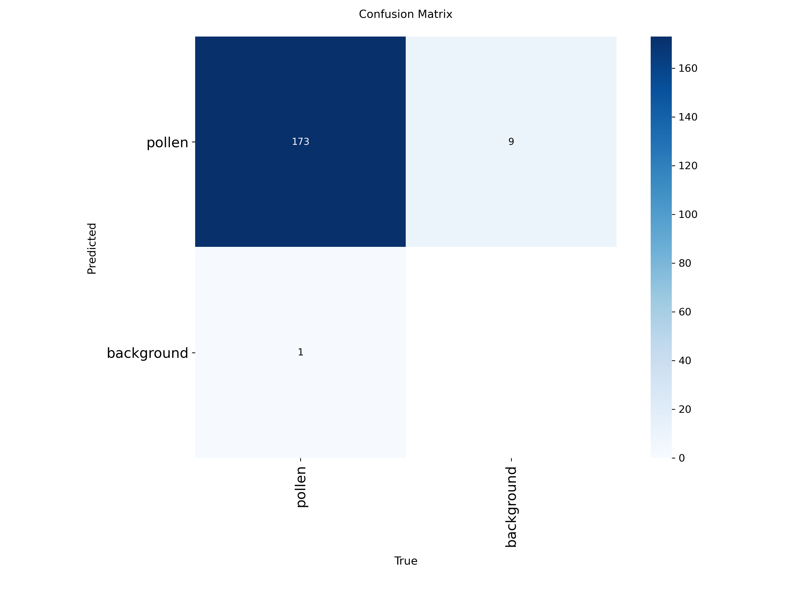
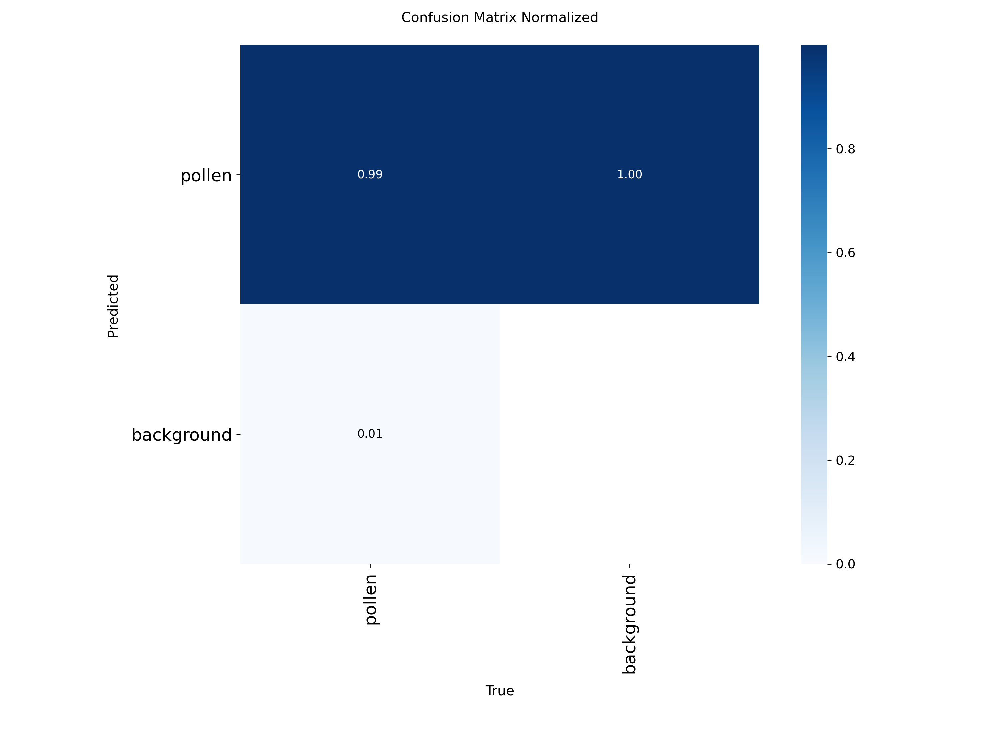
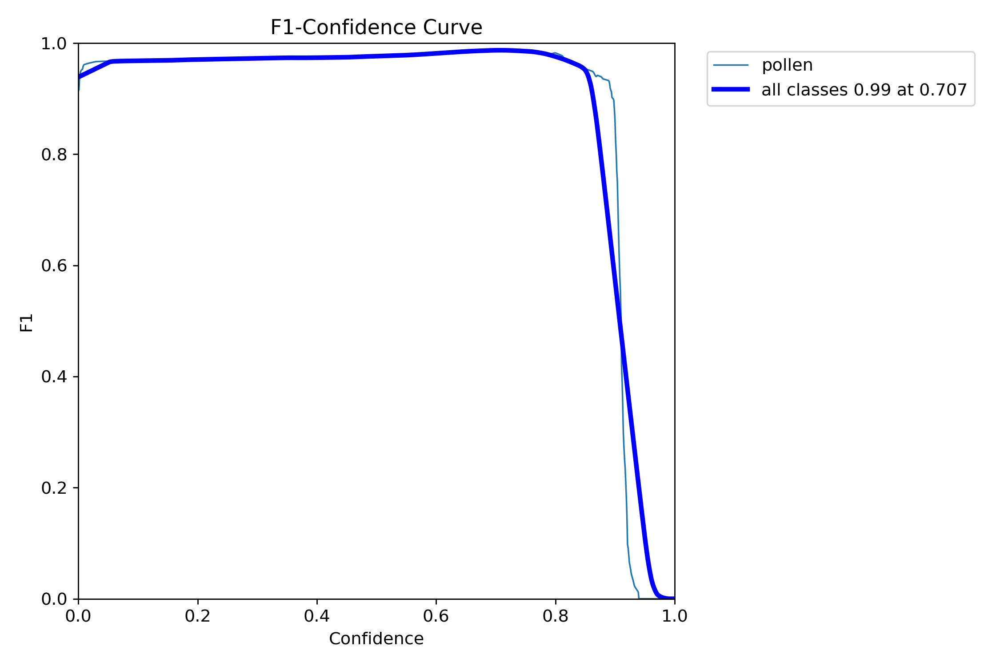
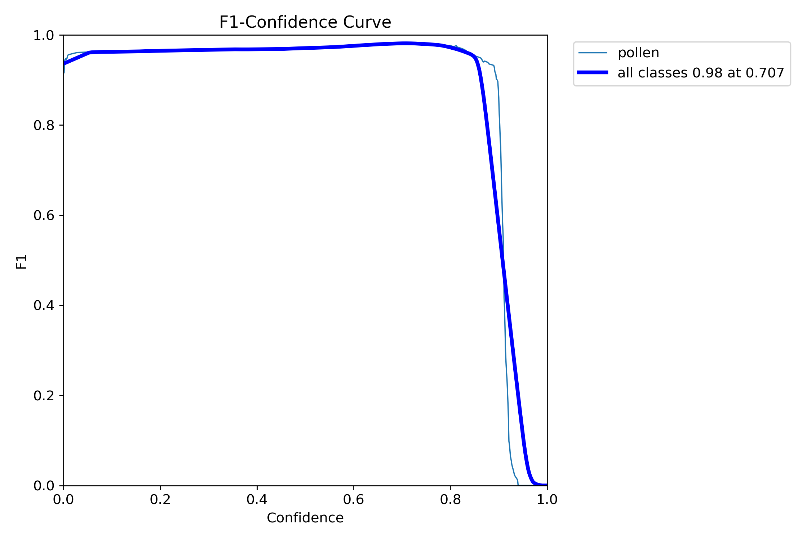
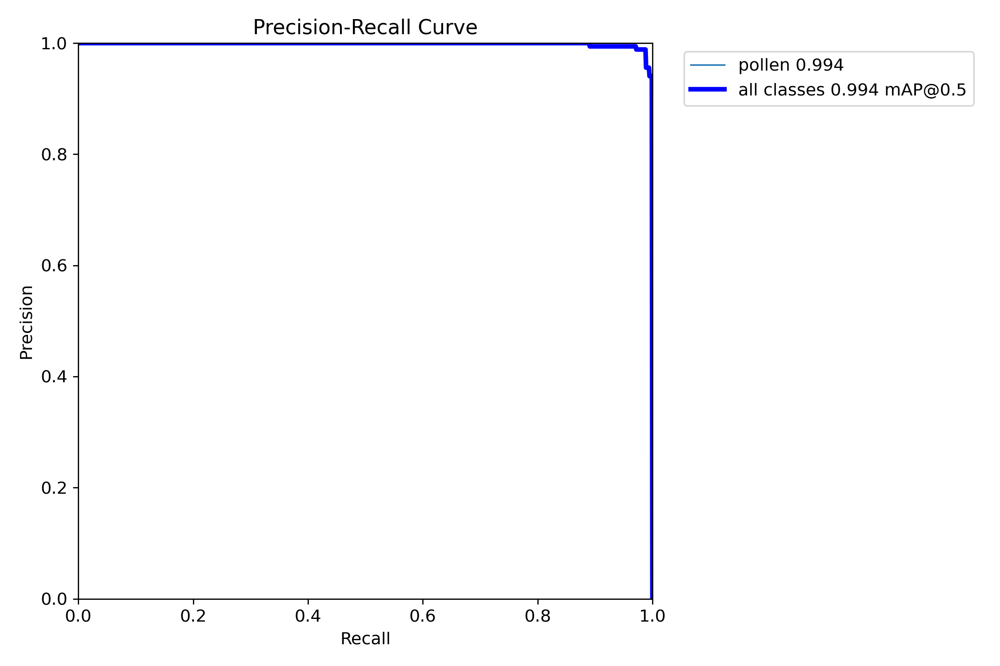
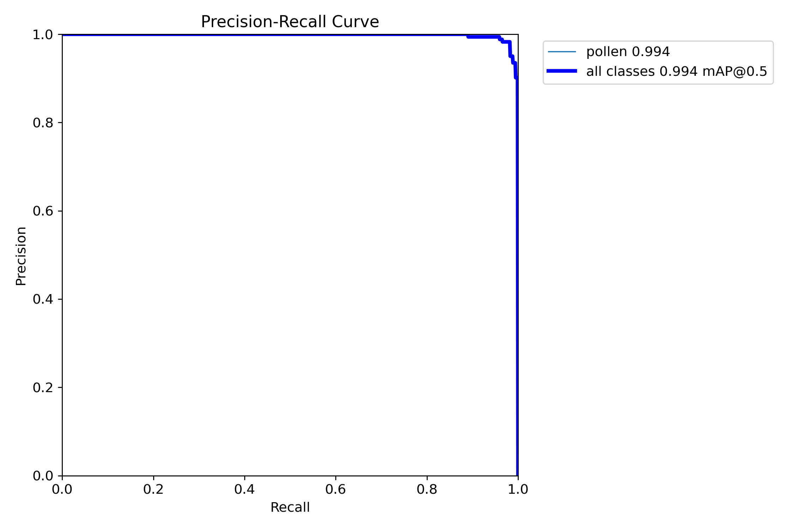

## 🌍 General Pollen Model

This model serves as the first stage of the pipeline, acting as a general detector for all potential pollen grains across the slide regardless of species.

- **Task**: Object Detection 
- **Training Dataset**: 523 total annotated tiles (431 training images, 92 validation images)
- **Annotations**: Bounding box annotations

*(Placeholder for General Model training curves)*

---

## 🌻 Species-Specific Model

This model operates on the objects extracted by the general model to perform final multi-species classification and segmentation.

- **Task**: Instance Segmentation & Classification
- **Training Dataset**: ~20,000 tiles
- **Annotations**: Pseudo-labeled segmentations via SAM / YOLO

### 📈 Diagnostic Metrics

Here are the diagnostic plots from the latest training run of the species-specific model.

#### Confusion Matrix

#### F1 Curve

#### Precision-Recall Curve

### Validation Batches
::: {layout-ncol=2}

:::
