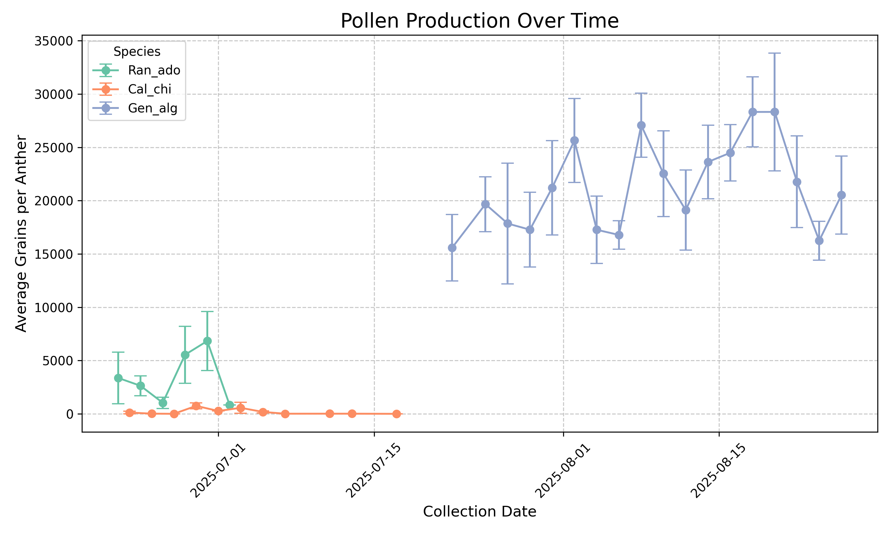
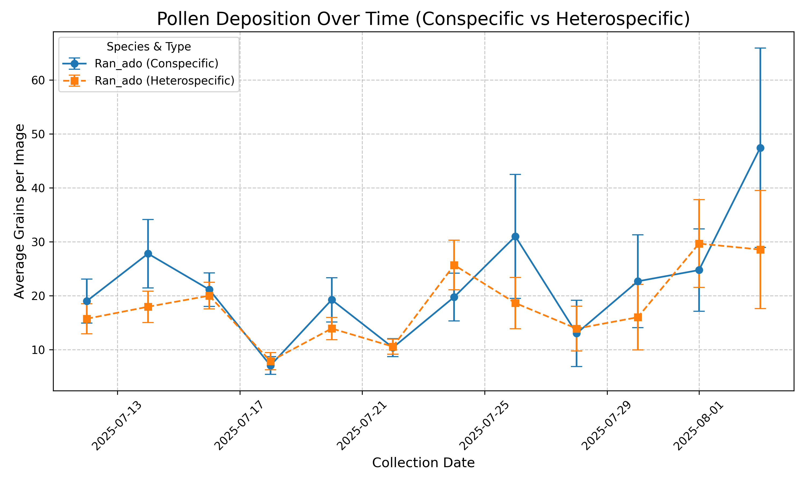

## 📊 Pollen Production Over Time

The following graph shows the aggregated pollen production across the time-series samples. The data shows the average number of pollen grains per anther per day, with standard error bars.

[📥 Download Aggregated Production Dataset (CSV)](results/pollen_production_aggregated.csv)

## 📅 Pollen Deposition Over Time

The following graph shows the aggregated pollen deposition detected across the time-series samples. The data shows the average pollen grains per image per day, specifically highlighting **Conspecific** pollen, with standard error bars.

[📥 Download Aggregated Deposition Dataset (CSV)](results/pollen_deposition_aggregated.csv)
